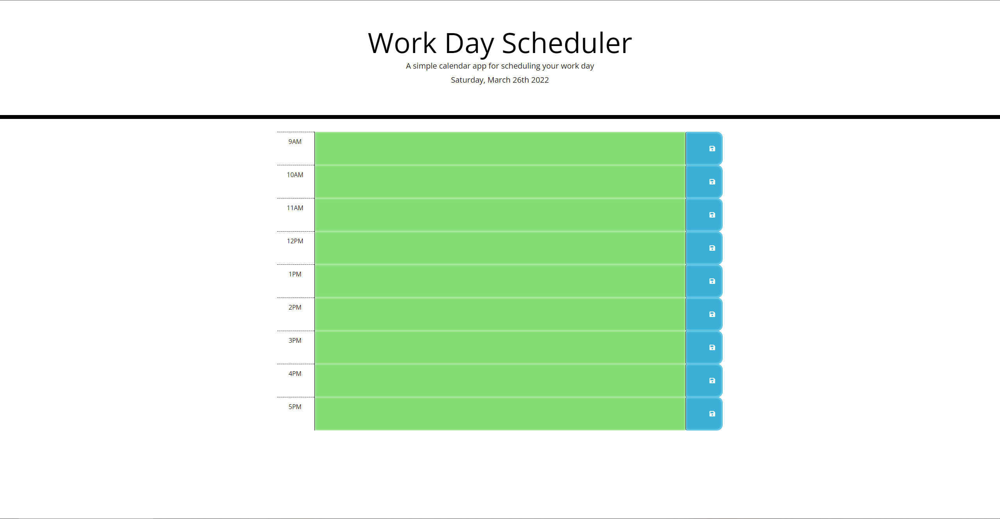

# Work-Day-Scheduler

---

## Description

<ul>
    <li>For this project my goal was to create a planner for a standard business hours work day.</li>
    <li>The UI provides a clean, and simple user experience.</li>
    <li>During this project, I was able to familiarize myself with third-party APIs.</li>
</ul>

---

## Technologies Used

<ul>
    <li>HTML</li>
    <li>CSS</li>
    <li>Javascript</li>
    <li>Bootstrap</li>
    <li>Moment</li>
    <li>jQuery</li>
</ul>

---

## Link

https://mahiv87.github.io/Work-Day-Scheduler/

---

## Mock-up

---

